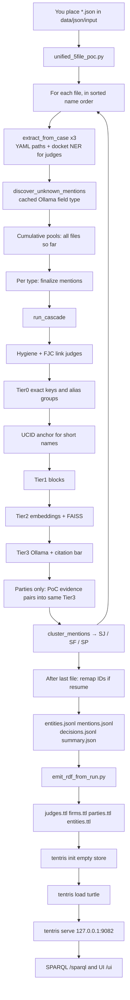

# Tier V3 — final report (this repository)

This file is the complete operator and design report for
[nikhilgoud003/V3_Phase1_Final](https://github.com/nikhilgoud003/V3_Phase1_Final).
It describes only what **this clone** does, from the moment you place PACER JSON
files on disk until a test Tentris server answers SPARQL.

Commands to type are in `README.md`. This file explains the system.

---

## 1. Is the professor’s Tier V3 done?

**Yes, for the product the professor asked to run:** one shared engine, three
entity types (judges, firms, parties), config in YAML, cascade Tier0 → Tier1 →
Tier2 → Tier3, cluster into stable IDs, emit RDF, load a Tentris graph.

That path is this repository:

1. `python3 scripts/unified_5file_poc.py` — read every `*.json`, resolve all three types together.
2. `python3 scripts/emit_rdf_from_run.py` — write Turtle.
3. `tentris init` / `tentris load` / `tentris serve` — empty test store, usually port **9082**.

**No, this clone is not the older research archive.** These are intentionally
absent so the repo stays only what you need to run:

| Not in this GitHub repo | Where it lived |
|-------------------------|----------------|
| Historical gold evaluation (Phase D / E / F F1 numbers) | research tree scripts and `data/runs/judges_*` |
| Live production Tentris on `:9080` (`tentris_judges_recall_fix_data`) | local disk only; this pipeline builds a **new** store |
| PACER input JSON | you copy them into `data/json/` |
| Old per-type runner `scripts/run_all_er.py` | replaced here by the one unified script |
| Docs, pilots, backups, unused scripts | not required to run |

### Honest remaining limits (do not claim these are fixed)

- Docket lines that name a judge by **surname only** (`before Judge DAVIS`) are still dropped. A person name must have at least two tokens (`First Last` or `First M. Last`). `before Honorable Ronald A. Guzman` **is** extracted.
- One run always **re-reads and re-resolves every JSON** in the folder. It does not skip files already seen. IDs are reused only when you resume (section 8).
- Tentris is not started by Python. You run the three Tentris commands after RDF exists.
- Unknown-field discovery and Tier2/Tier3 need a running Ollama with `qwen2.5:7b` and `nomic-embed-text`.

---

## 2. What it is

Entity resolution over U.S. federal PACER case JSON.

A **mention** is one observed string in one case (a judge name, a law-office name, a party name), plus the case it came from (UCID, court, role, dates).

An **entity** is the real-world person or organization those mentions collapse to. This system assigns:

| Type | Config | ID prefix | RDF class |
|------|--------|-----------|-----------|
| Judge | `configs/judges.yaml` | `SJ######` | `pacer:Judge` |
| Firm (counsel office) | `configs/firms.yaml` | `SF######` | `pacer:LawFirm` |
| Party (litigant) | `configs/parties.yaml` | `SP######` | `pacer:Party` |

The Python cascade is shared. Type differences live in YAML (paths, keys, prompts), not in separate programs.

**Why:** PACER writes the same judge or the same United States many ways (`USA`, `United States`, `Honorable Iain D. Johnston`). A knowledge graph needs one node per real entity, with the mentions and the decisions that linked them, queryable in SPARQL.

---

## 3. How it works (one picture)



Scratch cascade files go under a temporary folder inside the output directory and are deleted at the end unless you pass `--debug-steps`.

---

## 4. Before any JSON is read

You need all of this already true. The Python script does not install them.

1. **Python 3.10+** virtualenv and `pip install -r requirements.txt`.
2. **spaCy model** `en_core_web_sm` (docket judge NER).
3. **Ollama** listening at `http://localhost:11434` (override with `OLLAMA_HOST`).
   - Chat model default `qwen2.5:7b` (Tier3 and unknown-field typing).
   - Embedding model `nomic-embed-text` (Tier2 vectors, 768 dimensions).
4. **macOS OpenMP:** `export KMP_DUPLICATE_LIB_OK=TRUE` and `export OMP_NUM_THREADS=1` before the run, or FAISS can abort.
5. **Tentris v1.1.0** on `PATH` (often `~/.local/bin/tentris`) only for the last stage. No license file. Datastore directories must be mode `700`.
6. **Input:** a folder of PACER `*.json` case files. Nothing in `data/json/` is committed.

If Ollama or either model is down, `engine/preflight.py` fails the cascade before merges start (`PREFLIGHT_FAILED`).

---

## 5. What one PACER JSON contains (inputs the extractors use)

The engine does not assume a fixed schema beyond paths listed in YAML. Typical fields:

| JSON path | Used as |
|-----------|---------|
| `ucid`, `court`, `case_id`, `case_type` (`cr`/`cv`), `case_name`, `filing_date` | Case identity on every mention |
| `mdl_code` | Party sidecar only (evidence context, not a merge key by itself) |
| `judge`, `referred_judges` | Judge header sources |
| `parties[].name`, `parties[].judge`, `parties[].referred_judges`, party role / pacer id | Parties and criminal-case judges |
| `parties[].counsel[].name` | Negative evidence (not a judge/party) and counsel person |
| `parties[].counsel[].entity_info.office_name`, email, phone, fax, address | Firm mentions; domain derived from email |
| `docket[].docket_text` | Judge NER spans |

`case_type` matters for judges: criminal (`cr`) often stores the judge on party rows; civil (`cv`) often stores the judge on the case header. Both paths are in `configs/judges.yaml`.

---

## 6. Start to finish — every step after you launch the script

Command shape:

```bash
python3 scripts/unified_5file_poc.py \
  --json-dir data/json/input \
  --output-dir data/runs/my_run
```

### 6.1 Choose files

- Default: **every** `*.json` in `--json-dir`, sorted by filename. You will see `Will process N JSON file(s)`.
- `--limit N` keeps the first N after that sort.
- `--files a.json b.json` uses only those names.
- `--poc-bard5` uses only the original five Bard filenames. Do not use this for a 1000-file folder.

If you omit `--files` and do **not** pass `--poc-bard5`, a folder of 1000 files processes 1000 files.

### 6.2 Load three configs once

`engine/config_loader.py` reads `configs/judges.yaml`, `configs/firms.yaml`, `configs/parties.yaml`. Paths inside YAML are resolved against the repo root, or against `TIER_V3_OUTPUT_DIR` when the cascade writes mentions and decisions.

### 6.3 Loop: one file at a time, cumulative resolve

For file *k* = 1 … N:

**A. Read** the JSON into memory once.

**B. Known-field extract** (`engine/extract.py` `extract_from_case`), once per type, on a deep copy of the case.

- Walk every `extraction.sources[]` path with `engine/path_extract.py`.
- Build a mention id `mnt_` + SHA1 of stable parts (same case text → same mention id).
- Normalize the name (`engine/normalize.py`): strip honorifics, punctuation, lowercase, corporate suffixes, config `replace_regex`.
- **Parties only, after that:** apply `normalization.expand_abbreviations` from YAML. That is how `USA`, `U.S.`, `U.S.A.`, `United States`, and `United States of America` become the single string `united states of america`. Patterns are data in YAML, not a name list in Python. Anchors are full-string (`^usa$`), so `United States Postal Service` and `U.S. Bank` are not rewritten.
- Drop the mention if it exactly equals party, counsel, or court-personnel negative evidence for that type.
- Judges from docket text: `engine/docket_ner.py` (section 7).
- Firms: office class from config patterns and `data/external/firms_biglaw_cores.txt`; address trailing city can be split off the name.
- Attach `source_file` = the JSON filename.

**C. Unknown-field discovery** (still in `unified_5file_poc.py`).

- Walk remaining string leaves whose path pattern is not in the known-prefix set.
- Junk paths and junk values are rejected by `engine/discovery_validity.py` (docket numbers, dates, phones, raw_info blobs) **before** any LLM call.
- A never-seen path pattern gets **one** cached Ollama call: judge / firm / party / other. Cache file lives beside the scratch dir and is removed at the end.
- `other` is skipped. Typed values still pass that type’s finalize gates. They are not auto-merged.

**D. Party sidecar** (not a merge rule). Each party mention from this file records same-case judge names, firm names, and MDL flag. Later, `engine/poc_party_evidence.py` may send a near-duplicate pair that shares that context into **real Tier3**. A merge still requires the citation and MATCH bar. There is no deterministic “same judge ⇒ same party” merge.

**E. Finalize + cascade on the cumulative pool** (files 1..k, not only file k).

Scratch directory is deleted and recreated. `TIER_V3_OUTPUT_DIR` points at it so YAML `io.*` paths do not write into a previous production run.

Order is always judge, then firm, then party.

`_finalize_mentions` writes the type’s mentions JSONL (and transfer clues) and runs name-validity quarantine (`engine/name_validity.py`, optional LLM micro-pass `engine/llm_name_validity.py` when that YAML block is enabled).

Then `engine/tiers.py` `run_cascade` (section 6.4).

Parties, after the cascade: `adjudicate_poc_evidence_via_tier3` (max 25 pairs). If any pair merges, components are rebuilt and clustered again.

`engine/cluster.py` `cluster_mentions` turns union-find components into entity records. Safety splits: distinct FJC NIDs, transfer-clue conflicts, name-compatibility, generational suffixes, fund/plan types, when that type’s YAML asks for them.

**F. This step does not write `step_XX/` folders** unless `--debug-steps`.

The last step’s entities and mentions are what the final files contain. Earlier steps exist so each new file is resolved against everything already read.

### 6.4 Inside `run_cascade` (per entity type)

Early exit means: once two mentions are merged, later tiers do not re-decide that pair.

1. **Preflight** Ollama generate + embed.
2. **Decision journal** opens (`engine/provenance.py`). Every merge, non-merge, and abstain is one JSON line: method, confidence, rationale, signals.
3. **Mention hygiene** (`engine/mention_hygiene.py`): drop or quarantine very low-information strings using `data/external/common_surnames.txt` when the barrier says so. Parties can keep low-info names inside one UCID only (`low_info_within_ucid_only`).
4. **Name token profile** so the name gate treats surnames differently from docket prose.
5. **FJC link (judges only, if the YAML rule `fjc_nid_join` exists).** `engine/fjc.py` loads `data/judges_fjc.csv` and `data/external/fjc_court_crosswalk.json` and attaches an FJC `nid` when the name is unique in court (soft dates). Same NID later merges at Tier0. Two different NIDs in one cluster are split at cluster time.
6. **Tier0** deterministic groups (`tier0_merge_groups` + `apply_tier0_alias_groups`):
   - Judges: exact normalized name; exact name + court; FJC NID; domain-style keys as configured.
   - Firms: exact office name; email domain (identifying domains only); address keys; big-law core is classification, not an automatic global merge of every office.
   - Parties: exact name + same UCID; exact name + court + PACER id; exact name + court when the name has at least two tokens; corporate core + court.
   - **USA alias group** (`tier0.alias_groups` id `united_states_government`): after expansion, those names are one group with `merge_scope: global`. All such mentions in the run become **one** party entity. Cross-case skip-to-NO_MATCH for that group is turned off (`skip_alias_groups_cross_ucid: []`). This is the current policy in this repo.
7. **UCID anchor** (`engine/ucid_anchor.py`): a one-token mention in a case attaches only if exactly one fuller name in that same case matches. Otherwise it abstains. It does not guess across cases.
8. **Tier1 blocking:** profile blocks (surname, corp core, court, …) so Tier2 does not compare every pair.
9. **Tier2:** embed each mention profile with Ollama `nomic-embed-text`, index with FAISS (`engine/embeddings.py`). Candidate pairs are same-block and above the similarity floor, and not already Tier0-merged. Auto-merge only when the YAML similarity rule and information barrier allow it (`engine/name_compat.py`). Ambiguous pairs are the Tier3 queue. A small `tier2_marginal_recall.json` is written in the scratch reports dir.
10. **Tier3:** for each ambiguous pair, build a prompt from:
    - judges → `prompts/tier3_adjudicate.txt` + `prompts/tier3_output.schema.json`
    - firms → `prompts/tier3_adjudicate_firms.txt` + shared schema
    - parties → `prompts/tier3_adjudicate_parties.txt` + `prompts/tier3_output_parties.schema.json`
    - Ollama returns MATCH / NO_MATCH / UNCERTAIN with cited evidence keys.
    - `engine/tier3_citation.py` checks that cited facts exist on the mentions. A failed citation becomes UNCERTAIN.
    - Parties and the shared MATCH bar: MATCH needs at least one verified discriminating fact (same PACER id, same domain, phone, address, same FJC nid, or identical multi-token name in the same court — the exact fact list is in that type’s YAML). High confidence alone is not enough.
    - Below `abstain_confidence_below` the decision is forced UNCERTAIN.
    - Results cache to the YAML cache path under the scratch output dir.
    - Budget and same-block routing can skip pairs; those skips are counted in the cascade summary.
11. **Return** union-find, mention map, component lists, and a summary dict (tier counts). That summary is copied into `summary.json` → `cascade_final`.

### 6.5 After the last file — IDs

Clustering first assigns serial IDs in this run (`SJ000000` …). Then `remap_entity_ids` in the script:

| Flag | Behavior |
|------|----------|
| Default, and `output-dir/entities.jsonl` already exists | **Resume.** Reuse the previous `sjid` when the stable key matches. New keys get the next serial. |
| `--resume-from other/run` or `other/entities.jsonl` | Same reuse against that file. |
| `--cold-start` | Ignore prior files. New serials from zero. |

Stable keys (why the same entity keeps one id):

- Judge with an FJC nid → `judge:nid:<nid>` (court changes do not mint a new id).
- Judge without nid → normalized name + sorted courts.
- Firm → domain and/or name plus office city/state when present (`entity_signature` in `engine/rdf_emit.py`).
- Party in the USA alias group → one key `party:alias:united_states_government`.
- Other party → normalized name + sorted courts.

`summary.json` field `cold_start` is false when resume happened. `id_remap` counts reuse vs create.

**Important:** resume does not mean “only process the new files.” You still pass the full folder (5 + the rest, or all 1000). Resolution is recomputed. Matching entities keep their ids; the output files are rewritten.

### 6.6 Four result files

Written only at the end, in `--output-dir`:

| File | Contents |
|------|----------|
| `entities.jsonl` | One JSON object per entity. Field `type` is `judge`, `firm`, or `party`. Also `sjid`, `canonical_name`, `normalized_name`, `mention_ids`, `courts`, `ucids`, `fjc_nids` (judges), domains / office city (firms). |
| `mentions.jsonl` | One JSON object per surviving mention, same `type` field, plus `ucid`, `source_file`, `normalized_name`, role, extraction method. |
| `decisions.jsonl` | Journal rows from the **last** cascade (judge + firm + party + party evidence), annotated with both names, both source files, and `cross_file`. |
| `summary.json` | Elapsed seconds, file list, counts, cross-file entity list, per-file cumulative counts, full cascade summary, PoC evidence rows, discovery kept/rejected, id remap. |

`--debug-steps` also writes `step_XX_<stem>/` copies, `discovery_log.jsonl`, and `field_type_cache.jsonl`. Leave it off for a clean folder.

---

## 7. Docket judge extraction (why some lines were missed)

`engine/docket_ner.py` returns spans from one docket entry using two methods:

1. **Regex**
   - `Judge` / `Magistrate Judge` / `Chief Judge` + `First Last`.
   - `Honorable` / `Hon.` + `First Last` even when the word Judge is not between them (`before the Honorable Mary M. Rowland`).
2. **spaCy `PERSON`**, only if a judge cue sits just before the span, or the span itself starts with `Honorable` (spaCy often glues the honorific inside the person span).

Cleaning rules (to avoid garbage, not to list judge names):

- Middle initial must include a period, so `Consent Form` is not cut into `Consent F`.
- The words `a`, `an`, `the` are **not** trailing-stop words, because case-insensitive matching would delete middle initial `A.`.
- Procedural titles (`Consent Form`, `Assignment To`, `Magistrate Judge Consent Form`) yield **zero** names.
- Still requires **two or more** name tokens. `Judge DAVIS` and `Judge Goldberg` stay empty on purpose (high false-positive risk).

Accepted spans go through the same name-validity gates as header judges. A span can be extracted and then quarantined.

Header fields `judge` and `parties[].judge` do not use this NER. If the JSON has no header judge and the docket only says `Judge DAVIS`, that judge will be missing from mentions.

---

## 8. RDF emit (JSONL → Turtle)

```bash
python3 scripts/emit_rdf_from_run.py --run-dir data/runs/my_run
```

`scripts/emit_rdf_from_run.py` splits the three JSONL files by `type` and calls `engine/rdf_emit.py` `emit_ttl` three times, using each type’s YAML `rdf:` block.

For every entity:

- URI `http://scales-kg.org/id/<kind>/<sjid>` (`judge`, `firm`, or `party`).
- `rdf:type` `pacer:Judge` or `pacer:LawFirm` or `pacer:Party`.
- `pacer:hasName`, `skos:prefLabel`, id predicate (`hasSJID` / `hasSFID` / `hasSPID`).
- `pacer:hasCode` for each court.
- Judges: `pacer:hasFjcNid` when present.
- Firms: `pacer:hasDomain` from member mentions.
- Alternate name forms become `skos:altLabel` plus a `pacer:NameAssertion` with optional validity dates from filing dates.

For every mention:

- A `pacer:Case` for the UCID.
- A mention node (`JudgeMention`, firm mention class, or `Party` mention class from YAML).
- `pacer:mentionsIn` the case.
- `pacer:resolvedTo` the entity.
- Judges: case `pacer:assignedJudge` or `pacer:referredTo` from the mention role.
- Firms: `pacer:hasCounselOffice` when role is office.
- Parties: `pacer:hasRole` (`plaintiff` / `defendant` / `other`) is on the **mention**, never on the Party node, because the same party can switch sides across cases.

For every decision row of that type:

- `pacer:ResolutionDecision` with method, confidence, decision, rationale, and links `pacer:from` / `pacer:to` the two mentions.

Firms and parties YAML set `content_hash_uris: true`, so alias and decision URIs are content hashes (`inc_…`) and do not collide with a future incremental insert that still uses sequential `dec_00000`.

Outputs under `data/runs/my_run/rdf/`:

- `judges.ttl`, `firms.ttl`, `parties.ttl`
- `entities.ttl` — the three files concatenated (prefixes kept once)
- helper `_{type}_decisions_for_emit.jsonl` (inputs to emit, not loaded by themselves)

This script does **not** contact Tentris.

---

## 9. Tentris — new store only

Do this only after `entities.ttl` exists. Serve must be **down** for `tentris load` on that path.

```bash
export PATH="$HOME/.local/bin:$PATH"
rm -rf data/tentris_test_9082
mkdir -p data/tentris_test_9082
chmod 700 data/tentris_test_9082
tentris --datastore-path data/tentris_test_9082 init
chmod -R 700 data/tentris_test_9082
tentris --datastore-path data/tentris_test_9082 load --format turtle \
  data/runs/my_run/rdf/entities.ttl
tentris --datastore-path data/tentris_test_9082 serve 127.0.0.1:9082
```

What each command does:

| Command | Effect |
|---------|--------|
| `init` | Empty database in that folder (snapshots, transaction log). Does not open any other folder. |
| `load --format turtle` | Reads `entities.ttl` into that database. Fails if a server already holds the same path. |
| `serve 127.0.0.1:9082` | HTTP on port 9082 only. |

Endpoints:

- http://127.0.0.1:9082/sparql
- http://127.0.0.1:9082/ui
- http://127.0.0.1:9082/update (not used by this pipeline)
- http://127.0.0.1:9082/graph-store (not used)

Stop the server with Ctrl+C.

Example count:

```sparql
SELECT (COUNT(*) AS ?c) WHERE { ?s ?p ?o }
SELECT (COUNT(DISTINCT ?e) AS ?c) WHERE { ?e a <http://scales-kg.org/pacer#Judge> }
SELECT (COUNT(DISTINCT ?e) AS ?c) WHERE { ?e a <http://scales-kg.org/pacer#LawFirm> }
SELECT (COUNT(DISTINCT ?e) AS ?c) WHERE { ?e a <http://scales-kg.org/pacer#Party> }
```

This store is empty before load. It is not a copy of a live `:9080` graph. Do not pass `--datastore-path` pointing at any production directory.

`data/tentris_*` is gitignored.

`engine/kg_insert_safety.py` is the library used by the older pre-insert safety check (CREATE ids must not already exist, REUSE ids must). The commands above **replace** an empty store with a full TTL load, so that safety script is not in the default path.

---

## 10. What you should see when it is working

While `unified_5file_poc.py` runs, stdout shows, per file and per type:

- `STEP k/N file=…`
- `PREFLIGHT_OK` with embed dimension 768
- `Mention hygiene: …`
- `FJC linked: …` on judges
- `UCID anchoring: …`
- `Embedding … via Ollama/nomic-embed-text`
- `FAISS index: n=…`
- `Tier2 marginal recall candidates: …`
- On parties: `PoC party evidence: candidates=… tier3_calls=… merges_after_citation_MATCH=…`
- JSON counts: mentions this file, cumulative raw, cumulative entities, cross-file entities
- At the end: `ID remap: reuse=… create=…` or `ID assign (cold)`
- `RESULTS_WRITTEN …/entities.jsonl` and the other three files

Then emit prints three type lines and `COMBINED -> …/rdf/entities.ttl`.

Then Tentris logs `Loading successful` and `Starting to listen on 127.0.0.1:9082`.

---

## 11. Why each design choice

| Choice | Why |
|--------|-----|
| One engine, three YAML files | Adding a behavior for “only judges” without a config key would fork the cascade. The professor’s requirement was one pipeline for every entity type. |
| Tier0 before the LLM | Exact keys and FJC ids are safer and cheaper than asking a model. |
| Tier3 abstains | A wrong merge in a knowledge graph is worse than two nodes. Citation check and the MATCH bar exist to block hallucinated identity. |
| Cumulative re-cascade after each file | The entity set after file k includes files 1..k, so a repeat name can join an earlier mention before the run finishes. |
| One output folder | Per-file `step_XX` directories were debug snapshots. The product artifacts are the four files plus RDF plus Tentris. |
| Resume IDs | A second run used to mint `SJ000000` again even for the same judge. Resume keys keep the id when the same entity comes back. |
| USA as one party entity | Caption variants of the United States are one litigant. The expansion list is YAML and full-string anchored so agencies and banks stay separate. |
| Test Tentris on 9082, empty init | A clone or write to a live store on 9080 can be confused with production. This path never opens that directory. |
| No JSON in git | Case files are large and are the user’s input, not the program. |

---

## 12. Every file in this repository

### Root

| File | Use |
|------|-----|
| `README.md` | Commands only: setup, run ER, emit RDF, start Tentris. |
| `TIER_V3_FINAL_REPORT.md` | This document. |
| `requirements.txt` | Python libraries: PyYAML, pandas, FAISS, numpy, Ollama client, spaCy, rdflib, rapidfuzz, jsonschema. |
| `.gitignore` | Ignores `__pycache__`, virtualenvs, `data/json/**`, `data/runs/**`, `data/tentris_*/`, secrets. |

### `configs/`

| File | Use |
|------|-----|
| `judges.yaml` | Judge extract paths (header, parties, docket NER), normalization, FJC Tier0, name validity, hygiene, Tier1–3 prompts, cluster prefix `SJ`, RDF class `Judge`. |
| `firms.yaml` | Counsel `entity_info` paths, office classes, big-law list path, domain keys, cluster prefix `SF`, RDF class `LawFirm`, content-hash URIs. |
| `parties.yaml` | `parties[].name`, abbreviation expansions, USA alias group (global), office classes including government, exact name+court keys, party Tier3 prompt and MATCH facts, cluster prefix `SP`, RDF class `Party`. |

### `scripts/`

| File | Use |
|------|-----|
| `unified_5file_poc.py` | The pipeline entry. File loop, discovery, cascade, cluster, ID resume, four output files. |
| `emit_rdf_from_run.py` | Reads those outputs and writes TTL. Does not resolve entities again. |

### `engine/` (shared; no separate judge/firm/party programs)

| File | Use |
|------|-----|
| `__init__.py` | Package marker. |
| `config_loader.py` | Load YAML; resolve paths against repo root and `TIER_V3_OUTPUT_DIR`. |
| `path_extract.py` | Walk `parties[].counsel[].…` style paths; copy fields; office classification from config patterns and list files. |
| `extract.py` | `extract_from_case` and `_finalize_mentions`. Applies `expand_abbreviations` after normalize. Calls docket NER for judge sources marked NER. |
| `normalize.py` | Honorific strip, regex replace, corporate suffix strip, address peel, presentable names. |
| `docket_ner.py` | Judge names from docket sentences (regex + spaCy). |
| `discovery_validity.py` | Reject non-entity paths and junk strings before unknown-field LLM typing. |
| `name_validity.py` | Quarantine names that fail FJC / shape / garbage gates. |
| `llm_name_validity.py` | Optional cached LLM check that a span is actually a name of that type. |
| `name_repair.py` | Light repairs (cut glued docket junk) before a name is accepted. |
| `mention_hygiene.py` | Drop or limit low-information mentions. |
| `name_compat.py` | Block merges of incompatible person or org names (initials, generational distance, punct fold where configured). |
| `common_first_names.py` | First-name list used by name gates. |
| `fjc.py` | Load the FJC biographical CSV and link judge mentions to `nid`. |
| `ucid_anchor.py` | Attach a short name only to a unique longer name in the same case. |
| `tiers.py` | Union-find cascade: Tier0, alias groups, Tier1 blocks, Tier2, Tier3. |
| `embeddings.py` | Ollama embeddings and FAISS index for Tier2. |
| `preflight.py` | Fail fast if Ollama or models are unavailable. |
| `provenance.py` | Append-only decision journal JSONL. |
| `tier3_citation.py` | Verify cited evidence; enforce the MATCH bar. |
| `poc_party_evidence.py` | Enqueue party pairs that share case judge/firm/MDL context into Tier3 only. |
| `cluster.py` | Components → entity records; safety splits; assign serial ids before resume remap. |
| `rdf_emit.py` | Entity, mention, case, alias, and decision triples. Registry signature helpers used by ID remap. |
| `kg_insert_safety.py` | SPARQL checks before an incremental insert into an existing graph. Not called by the empty-store load in section 9. |

### `prompts/`

| File | Use |
|------|-----|
| `tier3_adjudicate.txt` | Judge pair prompt. |
| `tier3_adjudicate_firms.txt` | Firm pair prompt. |
| `tier3_adjudicate_parties.txt` | Party pair prompt. |
| `tier3_output.schema.json` | JSON schema for judge and firm model output. |
| `tier3_output_parties.schema.json` | Party model output, including `cited_evidence`. |
| `llm_name_validity.txt` | Prompt for the optional name-validity LLM pass. |

### `data/` (committed inputs, not case files)

| File | Use |
|------|-----|
| `judges_fjc.csv` | Federal Judicial Center roster for Tier0 NID linking. |
| `external/fjc_court_crosswalk.json` | Map FJC court names to PACER court codes. |
| `external/common_surnames.txt` | Surnames that make a short name low-information. |
| `external/firms_biglaw_cores.txt` | Office-class list for known large-firm cores. |
| `json/.gitkeep` | Empty placeholder. Put your `*.json` in a subfolder such as `data/json/input/`. |
| `runs/.gitkeep` | Empty placeholder. Run outputs appear here and are gitignored. |

### `tests/`

| File | Use |
|------|-----|
| `test_docket_ner_procedural.py` | Procedural docket phrases must not become judge mentions; real `Signed by Judge …` lines must. |
| `test_usa_expand_and_honorable_ner.py` | YAML expansions collapse USA variants; `Honorable First Last` extracts. |

---

## 13. End-to-end checklist

1. Clone, venv, pip, spaCy model, Ollama models, Tentris binary (section 4).
2. Copy PACER JSON into `data/json/input/`.
3. Run `unified_5file_poc.py` into `data/runs/my_run` with `KMP_DUPLICATE_LIB_OK` and `OMP_NUM_THREADS`.
4. Confirm four files and `summary.json` → `counts`.
5. Run `emit_rdf_from_run.py`.
6. `tentris init` a new `700` directory, `load` `entities.ttl`, `serve` `127.0.0.1:9082`.
7. SPARQL count triples and the three classes.
8. Later runs: same `--output-dir` reuses ids; pass `--cold-start` only when you want new serials from zero.

That is the whole pipeline in this repository.
